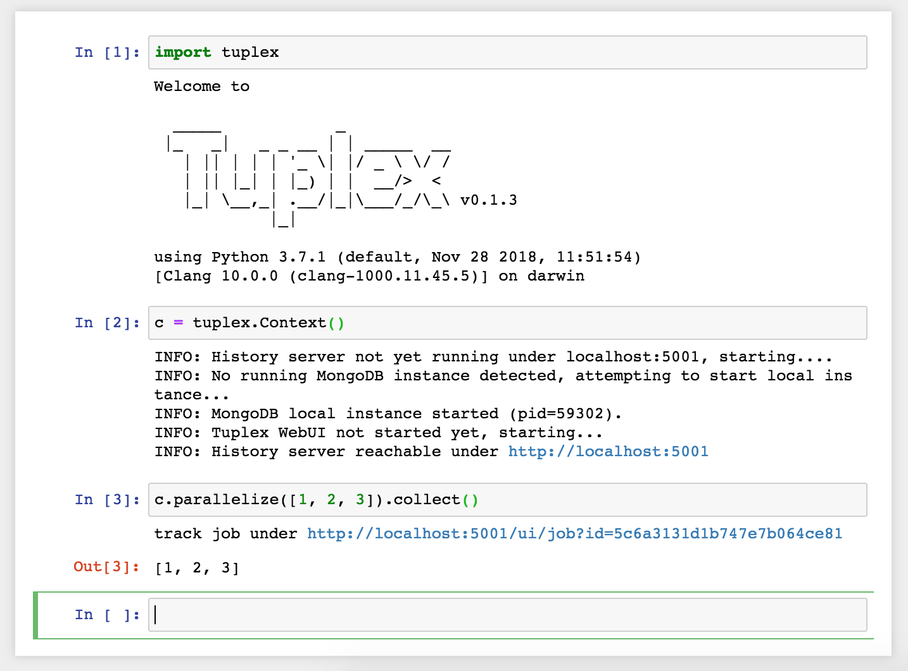

Getting started
===============

Download
--------
Tuplex is available for MacOS and Linux. The current version has been tested under MacOS 10.13-10.15 and Ubuntu 18.04 and 20.04 LTS.

To install Tuplex, you can use a PyPi package for Linux, or a Docker container for MacOS.

**Linux, Python 3.7-3.9:**

.. code-block:: console

    pip install tuplex

**MacOS, Catalina or later:**

.. code-block:: console

    docker run -p 8888:8888 tuplex/tuplex

Alternatively, you can :ref:`compile Tuplex from source <compile_from_source>`.

.. raw:: html

  <hr>

Overview
------------

Tuplex consists of three components: the Python frontend, C++ backend and the Tuplex WebUI.

If you installed Tuplex via PyPi or Docker, everything is preinstalled.

For installations from source, the frontend/backend package are within the :file:`<build-prefix>/dist/python` folder and can be installed via

.. code-block:: console

    python3 setup.py install

or for development mode

.. code-block:: console

    python3 setup.py develop

Analogously, in order to use the Tuplex WebUI the corresponding package needs to be installed which can be found in ``historyserver``.

.. raw:: html

  <hr>

Basic usage
-----------
Tuplex behaves like a standard Python package. To test, whether the package works you can type python3 in a terminal

.. code-block:: console

  python3

which should start the CPython interpreter in interactive mode.

.. code-block:: console

  Python 3.9.0 (default, Oct 27 2020, 14:15:17)
  [Clang 12.0.0 (clang-1200.0.32.21)] on darwin
  Type "help", "copyright", "credits" or "license" for more information.
  >>>

With ``import tuplex`` the system will be imported. Tuplex automatically creates then a Tuplex Interactive shell within the interpreter.

.. code-block:: console

  Welcome to

    _____            _
   |_   _|   _ _ __ | | _____  __
     | || | | | '_ \| |/ _ \ \/ /
     | || |_| | |_) | |  __/>  <
     |_| \__,_| .__/|_|\___/_/\_\ 0.3.0
              |_|

  using Python 3.9.0 (default, Oct 27 2020, 14:15:17)
  [Clang 12.0.0 (clang-1200.0.32.21)] on darwin
   Interactive Shell mode
  >>>


To create a context object, which serves as central entry point for all pipelines, type ``c = Context()``.
Depending on your configuration, this might take a while since Tuplex may start up its history server. To run a simple job, execute e.g., the following source code snippet.

.. code-block:: python

  c.parallelize([1, 2, 3]).map(lambda x: x * x).collect()

Alternatively, you can write your pipeline in a file :file:`pipeline.py` and execute it via ``python3 pipeline.py``.

Tuplex can be also used in Jupyter notebooks.



You can find more examples on how to use the Tuplex Python API under :ref:`examples`.

.. raw:: html

  <hr>

Creating Pipelines
------------------
A simple example of Tuplex in action is

.. code:: python

    from tuplex import *
    c = Context()
    res = c.parallelize([1, 2, 3, 4]).map(lambda x: (x, x * x)).collect()
    # this prints [(1, 1), (2, 4), (3, 9), (4, 16)]
    print(res)

This produces an array of tuples whose second component holds the square of the first.

Imagine now, a user would like to execute the following snippet

.. code:: python

    from tuplex import *
    c = Context()
    res = c.parallelize([1, 2, None, 4]).map(lambda x: (x, x * x)).collect()
    # this prints [(1, 1), (2, 4), (4, 16)]
    print(res)

Using regular python or Apache Spark, this would result in an error and the job would crash. However, Tuplex collects records that cause errors in a special memory region which allows for later resolution using its API.

.. code:: python

    from tuplex import *
    c = Context()
    res = c.parallelize([1, 2, 3, 4]) \
           .map(lambda x: float(x) / (x - 1)).collect()
           .resolve(ZeroDivisionError, 0.0) \
    # prints [0.0, 2.0, 1.5, 1.33]
    print(res)

Of course this toy example does not really require a sophisticated resolution mechanism. However, when processing large
quantities of input files, a job may fail after an unpredictable amount of time. In the best case after seconds, in the
worst case after a couple days or even weeks. As for most frameworks, the more robust the pipeline itself needs to be
towards the input data, the more tests need to be written, the pipeline tested for different scenarios and a use-case
specific special error treatment implemented. All of it coming at the
sacrifice of speed and efficient pipeline writing. Tuplex helps to solve this problem by treating errors as first class
citizens and making thus pipeline deployment and maintenance easier with its close-to-zero overhead when it comes
to exception handling.

Core classes
````````````

    :class:`tuplex.Context`
    Main object that allows to construct a pipeline.

    :class:`tuplex.DataSet`
    Abstraction holding a list of tuples together. DataSets are mapped, filtered or processed in a monadic way using user defined functions (UDFs).

.. raw:: html

  <hr>

.. _compile_from_source:

Building Tuplex from source
----------------------------

1. Using Docker
```````````````

We provide a Ubuntu 18.04 based docker image which can be used for development/testing/running Tuplex. To build the image, go into the ``docker`` folder, first edit ``create-image.sh`` to not run the ``docker push`` command. Then, run

.. code-block:: console

  ./create-image.sh

to create the image or pull it via ``docker pull tuplex/ubuntu1804`` if you use docker hub (i.e. make sure to login first via ``docker login``).
This will create a docker image ``tuplex/ubuntu1804``.
You can start the container then via

.. code-block:: console

  docker run -it tuplex/ubuntu1804 bash


which gives you a login looking something like ``root@00967454648b`` as well. To copy the source code over to the container, run the ``./copy-to-docker.sh`` script in the root directory (on another terminal! not within the docker container) via

.. code:: console

  ./copy_to_docker.sh 00967454648b


For some reason, syncing between docker and the local filesystem seems broken. To be sure, run the script two times.
In the docker login shell, then go to the ``/code`` directory where you can find the current code.

.. code:: console

  cd /code


To build and run tuplex, follow the steps in the general section outlined below.

Note: you can also mount the directory via a docker volume of course.

Docker compose
``````````````

If you have docker compose installed, another convenient way to quickly startup the docker image is to simply run

.. code:: console

  docker-compose build

to build an image ``dev`` first, and then

.. code:: console

  docker-compose up

to run the image and setup SSH/GDB Server connections. I.e. you can connect via ssh then to the image using

.. code:: console

  ssh -p 7776 debugger@localhost # password is dev


2. Under Linux (Ubuntu 18.04)
`````````````````````````````

Since we base the docker image on Ubuntu 18.04, you can simply use the script provided in ``scripts/ubuntu1804/install_reqs.sh`` to install all dependencies. Before running it blindly, make sure to open it and go through it to know how it will affect your system setup.

3. Under Mac OS X
`````````````````

A convenient option to install packages under Mac OS X is `Homebrew <http://brew.sh>`_. First, make sure you have XCode installed. Then, install the following formulas via Homebrew:

.. code:: console

  brew install git cmake python@3.9 llvm@9 boost \
               boost-python3 aws-sdk-cpp pcre2 antlr4-cpp-runtime \
               yaml-cpp celero gflags libmagic

Further, you need to install the ``cloudpickle`` python module in order to compile Tuplex.

.. code:: console

  pip3 install cloudpickle # or use python3 -m pip install cloudpickle


Note: Per default Tuplex uses static libs. However, recently brew changed the AWS SDK to be with shared libs, i.e. running ``cmake`` might complain about missing ```*.cmake`` files. To deal with this, you've multiple options:

1. Build without AWS SDK support, i.e. simply pass ``-DBUILD_WITH_AWS=OFF``
2. Install AWS SDK and compile it as static libs https://github.com/aws/aws-sdk-cpp, i.e. pass ``-DBUILD_SHARED_LIBS=OFF`` to the cmake command. Looking into ``scripts/ubuntu1804/install_reqs.sh`` might be helpful, as the AWS SDK is installed there in static lib mode.
3. enable shared libs for tuplex, i.e. add ``-DBUILD_SHARED_LIBS=ON`` to the command below.

4. Under Windows
```````````````````

Unfortunately, there's no support for Tuplex on Windows yet. You may use the docker image though or a virtual machine. Note that the docker engine requires Windows Pro, if you're a Brown student the university may provide you with a license at no cost.

General Build and test instructions
```````````````````````````````````

After having installed the dependencies on your system, in order to create a release version of Tuplex, run

.. code:: console

  mkdir -p build &&
  cd build &&
  cmake -DCMAKE_BUILD_TYPE=Release .. &&
  make -j$(nproc)


The python package can then be found in ``build/dist/python``. Use one of the following options to install tuplex:

.. code:: console

  python3 setup.py develop # installs development version
  python3 setup.py install --user # installs Tuplex for current user
  python3 setup.py install # if you have enough privileges, you can use this version


Running C++ tests
`````````````````

Tuplex has >500 C++ tests currently. To execute them, run ``ctest`` in your ``build`` directory.
You may select a subset of tests via the ``-R`` flag. ``--output-on-failure`` will print the logs whenever a test fails. Alternatively, the gtest executables are found in ``dist/bin`` and can be run directly with standard GoogleTest flags.

Running Python tests
````````````````````````

Tuplex uses pytest as testing framework. To run the tests go to ``build/dist/python``. Then, first install tuplex (e.g. via ``python3 setup.py develop``). To execute the tests, use

.. code:: console

  py.test

or

.. code:: console

  python3 -m pytest
